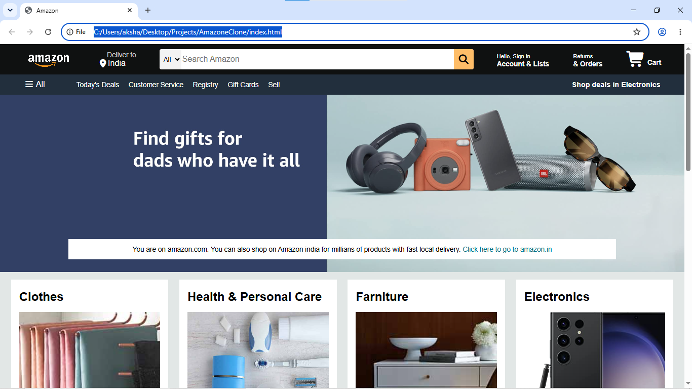

## Author : Akshay Dholakiya

A responsive **Amazon Homepage Clone** built using **HTML5** and **CSS3**. This project recreates the look and feel of Amazon's landing page to practice front-end web development and modern CSS techniques.

## Features

- Search Bar
- Hero Banner
- Product Categories Section
- Product Cards
- Footer Section
- Responsive Layout
- Clean and Organized Code

## Technologies Used

- HTML5
- CSS3
- Flexbox
- CSS Grid
- Font Awesome (if used)

##  Project Structure

```
Amazon-Clone/
│── index.html
│── style.css
│── images
└── README.md
```

## Preview




## Learning Objectives

This project helped me practice:

- HTML page structure
- CSS styling
- Flexbox layouts
- CSS Grid
- Creating real-world UI clones
- Writing clean and maintainable code

## Contributing

Contributions are welcome! Feel free to fork this repository and submit a pull request.

## License

This project is created for educational purposes only and is not affiliated with or endorsed by Amazon.

---

⭐ If you like this project, don't forget to star the repository!